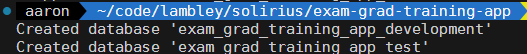
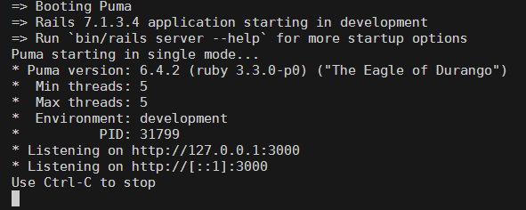
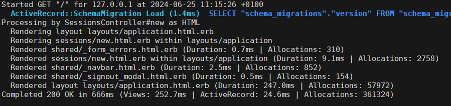

# Grad Academy Debugging App

This is the base Graduate Academy debugging app (no errors - at least, not intentional). The following is a setup guide for new starters.

## Contents
- Setup 💻
  - [General Setup (Clone Repository, Setup Ruby)](#general-setup-clone-repository-setup-ruby)
  - [Setting Up the Ruby on Rails App](#setting-up-the-ruby-on-rails-app)
    - [PostgreSQL](#postgresql)
    - [Ruby on Rails](#ruby-on-rails)
    - [Setting Up the Ruby on Rails Database](#setting-up-the-ruby-on-rails-database)
- [Running the Application](#running-the-application)

## Setup 💻

In this setup, you will:
- Have all the necessary technology on your machine:
  - Terminal (with Xcode installed)
  - Homebrew
  - VSCode
  - Github account
  - Github CLI
  - Rbenv
  - Ruby

### General Setup (Clone Repository, Setup Ruby)

1. **Clone the Repository**:
   - If you need a refresher on how to setup your laptop, or want to do this again at another time, follow this tutorial: [training_github_pages](https://github.com/Solirius/training_github_pages) tutorial.
   - Git clone the repository:
     - Click on the green `<> Code` button.
     - Select `SSH`.
     - Copy the value, e.g., `git@github.com:lambley/exam-grad-training-app.git`.
     - On your machine, in the folder you want this app to be in, use this command in your terminal:
     ```bash
     git clone git@github.com:lambley/exam-grad-training-app.git
     ```

2. **Install rbenv**:
   - Ensure you have `rbenv` installed - this project uses `Ruby 3.3.0`.
   - Install via this command in your terminal (read more [here](https://github.com/rbenv/rbenv)):
     ```bash
     brew install rbenv ruby-build
     # then run the following command after install is complete
     rbenv init
     ```

3. **Install Ruby**:
   - Run the following command in your terminal to install the version of Ruby we're using (this will take a few minutes to install):
     ```bash
     rbenv install 3.3.0
     ```

4. **Verify Ruby Installation**:
   - To check that you have installed Ruby correctly, run the following commands:
     ```bash
     rbenv local
     # you should see this output:
     # 3.3.0
     rbenv shell
     # you should also see this output:
     # 3.3.0
     ```
   - If you get errors like `rbenv: no shell-specific version configured`, you need to set the version for the local or shell environments. To do so, run either `rbenv shell 3.3.0` or `rbenv local 3.3.0`.

At this point, you should have:
- A working Terminal with Github working on the command line.
- A local version of this application on your machine.
- rbenv and Ruby 3.3.0 installed on your device.

> **IMPORTANT**:
> If you are stuck for more than 15 minutes during setup or encounter any unexpected errors, please speak to one of the tutors.

### Setting Up the Ruby on Rails App

In this section, you will:
- Install PostgreSQL database software via Homebrew.
- Install application dependencies.
- Setup the database.
- Launch the app on `localhost:3000`.

#### PostgreSQL
To install PostgreSQL, use the following commands in your terminal:
> Read more about PostgreSQL setup [here](https://wiki.postgresql.org/wiki/Homebrew)
```bash
brew install postgresql@15 libpq
brew link --force libpq
```
- To check that you have installed PostgreSQL correctly, run the following:
```bash
# to login to the default database
psql -d postgres
```
you should see:
```bash
psql (15.x)
Type "help" for help.

postgres=#
```
to exit, type in `\q;` or `exit;` (semicolon may not be necessary)

#### Ruby on Rails
To setup `Ruby on Rails`, we will use the `Bundler` package manager.

Ideally, open the terminal window in VSCode:
  - Terminal > New Terminal
  - Or, `Ctrl + Shift + Backtick`

- To install `bundler`:
```bash
gem install bundler
rbenv rehash
```

- In the terminal, then run `bundle install` (or just `bundle`)
  - This will install all the application dependencies, including the Ruby on Rails framework

#### Setting up the Ruby on Rails database
Now that we have PostgreSQL and all our dependencies installed, you need to run the following commands to setup the database.

In the terminal run:
```bash
rails db:setup
rails db:migrate
```
You should see this:



We will know populate the database with some dummy records:
```bash
rails db:seed
```

That's it, the database is setup!

## Running the Application

To run the Ruby on Rails Application, run this command in the terminal:
```bash
rails server
```

You should see this:


Navigate to `http://127.0.0.1:3000` in your browser. When you do, you will see the server window update - these are your server logs - very important in debugging!



# Setup finished

You should be setup to start debugging. Follow the debugging document and try to find and solve each error.

Good luck and happy debugging 🐛
